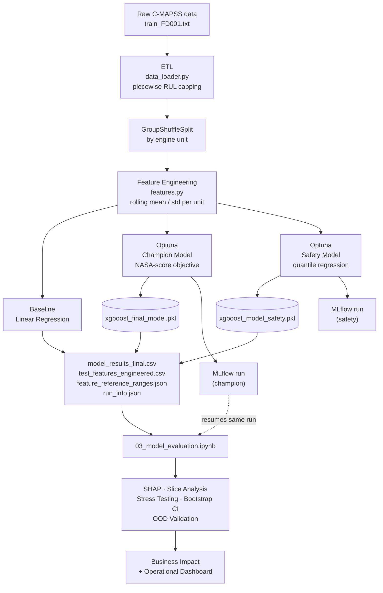

# Predictive Maintenance — Turbofan Remaining Useful Life (RUL) Estimation

Production-oriented MLOps pipeline that predicts how many operating cycles a
turbofan engine has left before failure (NASA C-MAPSS FD001), and translates
that prediction into an operational decision — not just a number.


---

## Table of Contents

- [Problem Statement](#problem-statement)
- [Key Features](#key-features)
- [Architecture](#architecture)
- [Tech Stack](#tech-stack)
- [Project Structure](#project-structure)
- [Quickstart](#quickstart)
- [Methodology](#methodology)
- [Evaluation & Robustness](#evaluation--robustness)
- [Testing](#testing)
- [Results](#results)
- [Inference API](#inference-api)
- [Collaboration Workflow](#collaboration-workflow)
- [Limitations](#limitations)
- [Roadmap](#roadmap)
- [License](#license)
- [Author](#author)

---

## Problem Statement

Unplanned failure of a jet engine is enormously more expensive than
maintaining it early — but maintaining every engine on a fixed schedule
wastes the remaining useful life it still had. The standard framing is
**Remaining Useful Life (RUL) prediction**: given an engine's sensor history
up to the current cycle, estimate how many operating cycles remain before it
degrades past a safe operating threshold.

This project trains on **NASA's C-MAPSS FD001** subset (single operating
condition, single fault mode — the simplest of the four C-MAPSS subsets, a
stated assumption, not something the project hides — see
[Limitations](#limitations)). The deliverable isn't a notebook that prints an
RMSE; it's a full pipeline that goes from raw sensor logs to a maintenance
decision with a dollar figure attached, built and reviewed the way a small
ML team actually ships one.

## Key Features

- **Two-model architecture, not one.** A point-estimate champion model
  (XGBoost, hyperparameters tuned against the official NASA/PHM08 asymmetric
  score) paired with a separate quantile-regression **safety model** that
  gives a conservative lower bound on RUL — the number an operator should
  actually ground an engine on, not the point estimate.
- **Leak-safe nested cross-validation.** Hyperparameter search uses an outer
  `GroupKFold` (by engine, so no engine's cycles appear in both train and
  validation) with an *inner* `GroupShuffleSplit` for early stopping — the
  early-stopping validation set never leaks into the score being optimized.
- **Domain-correct objective.** Optuna optimizes the actual NASA/PHM08
  scoring function (asymmetric — late predictions cost more than early ones),
  not a generic RMSE that treats both directions of error as equally bad.
- **Interpretability that reaches production.** SHAP isn't confined to a
  notebook plot — `predict_with_explanation()` returns the top local SHAP
  drivers behind every single prediction, in the same call an API would make.
- **Statistical rigor on the business claim.** The "XGBoost beats the linear
  baseline" claim is backed by a paired bootstrap confidence interval, not
  two point estimates — same for the net-savings dollar figure, which
  separately tracks missed failures *in the critical zone* rather than a
  single blended miss count.
- **Robustness testing.** Sensor dropout and Gaussian noise are injected into
  the test set to measure how much RMSE degrades under realistic sensor
  failure/drift, instead of only ever evaluating on clean data.
- **Out-of-distribution guard.** Inference checks incoming features against
  the training distribution and flags low-confidence predictions instead of
  silently returning a confident-looking number for input unlike anything
  the model was trained on.
- **Config-driven, not magic-number-driven.** Every threshold, cost
  assumption, and hyperparameter search setting lives in one
  `configs/config.yaml`, imported by the notebooks, `src/train.py`, and
  `dvc.yaml` alike.
- **MLOps, wired together, not bolted on.** DVC pipeline stages enforce that
  evaluation can only run against artifacts training actually produced;
  MLflow logs live inside the exact run that trained the model being
  evaluated — not a disconnected "evaluation" run.

## Architecture



`dvc.yaml` encodes this as two stages — `train` (`python src/train.py`) and
`evaluate` (the notebook above) — so `dvc repro` refuses to evaluate against
stale or missing training artifacts, and automatically re-runs training when
`config.yaml` or the raw data changes. `01_eda.ipynb` sits outside this
dependency chain by design — it's exploratory, and documents *why* the
pipeline's modeling choices (piecewise capping, no feature scaling, rolling
windows) are the right ones, rather than gatekeeping `02`.

## Tech Stack

| Category | Tools |
|---|---|
| Modeling | XGBoost, scikit-learn |
| Hyperparameter search | Optuna (nested Group K-Fold CV) |
| Interpretability | SHAP (global + local) |
| Experiment tracking | MLflow (params, metrics, models, figures, tables) |
| Pipeline / data versioning | DVC |
| Large file versioning | Git LFS (`*.pkl`, `*.joblib`) |
| Testing | pytest |
| CI | GitHub Actions |
| Serving | FastAPI (`api/`) |
| UI / demo | Streamlit (`app/`) |
| Containerization | Docker, Kubernetes (`deployment.yaml`) |
| Language | Python 3.10+ |

## Project Structure

```
predictive-maintenance/
├── api/                     # FastAPI serving layer
│   ├── main.py               # delegates to src/inference.py — no duplicated logic
│   └── schemas.py
├── app/                      # Streamlit demo UI
├── configs/
│   └── config.yaml           # single source of truth for every parameter
├── data/
│   ├── raw/                  # C-MAPSS train/test/RUL files
│   └── processed/            # cleaned data + exported evaluation artifacts
├── docs/
│   ├── architecture.md
│   ├── api.md
│   └── deployment.md
├── models/                   # persisted .pkl/.joblib artifacts (Git LFS)
├── notebooks/
│   ├── 01_eda.ipynb           # exploratory — documents the "why" behind 02's choices
│   ├── 02_model_training.ipynb    # orchestrates src/, produces artifacts
│   └── 03_model_evaluation.ipynb  # loads artifacts only, no shared state with 02
├── reports/figures/          # saved evaluation plots
├── scripts/                  # train.sh / test.sh / deploy.sh
├── src/
│   ├── data_loader.py         # raw ingestion, piecewise RUL capping
│   ├── features.py            # rolling-window feature engineering
│   ├── evaluation.py          # NASA score, health score, slice/stress/bootstrap/OOD/SHAP, business impact
│   ├── train.py                # CLI-runnable training pipeline (what DVC calls)
│   ├── inference.py           # production inference, mirrors the training feature pipeline
│   └── utils.py               # config loading, project-root path resolution
├── tests/
│   ├── test_evaluation.py     # bootstrap CI, OOD detection, slice metrics
│   └── test_inference.py      # SHAP explanation path, feature reconstruction
├── .github/workflows/ci.yml
├── .env.example
├── .gitattributes             # Git LFS tracking rules
├── dvc.yaml                    # train -> evaluate pipeline definition
├── Dockerfile
└── requirements.txt
```

`02` and `03` share zero in-memory state. Everything `03` needs — models,
predictions, feature matrices, baseline metrics, OOD reference ranges, MLflow
run IDs — is written to disk by `02` / `train.py` and reloaded from a fresh
kernel. This is enforced structurally by `dvc.yaml`, not just by convention.

## Quickstart

```bash
git clone <this-repo>
cd predictive-maintenance
git lfs install && git lfs pull        # fetch the tracked .pkl/.joblib artifacts
pip install -r requirements.txt
pip install dvc mlflow pytest

# Reproducible pipeline (recommended)
dvc init
dvc add data/raw
dvc remote add -d storage <your-remote>   # S3 / GDrive / local path
dvc repro                                  # runs train -> evaluate end to end

# Or run pieces individually
python src/train.py                        # training only
jupyter notebook notebooks/03_model_evaluation.ipynb   # evaluation only, once 02/train.py has run once

# Tests
pytest tests/ -v

# Inspect experiment tracking
mlflow ui --backend-store-uri sqlite:///mlflow.db
```

## Methodology

**RUL target — piecewise capping.** Raw RUL (cycles until failure) decreases
linearly and unboundedly from the start of an engine's life, but degradation
is only reliably observable in roughly the last 125 cycles. Cycles further
from failure are capped at `max_rul` (config-driven, default 125) rather than
given a large, mostly-noise target — the standard C-MAPSS convention (Heimes,
2008).`01_eda.ipynb` (Section 9) demonstrates this effect on a schema-matched
synthetic dataset (no real FD001 data was available at authoring time);
the pattern is expected to hold on real data but hasn't been re-verified
against it yet.

**Features — grouped rolling statistics.** Rolling mean/std per sensor,
grouped by engine `unit` so the window never crosses from one engine's
history into another's, and trailing (backward-looking) by construction so
no future cycle ever leaks into a past row's features.

**Objective — the actual NASA score, not RMSE.** The PHM08 scoring function
penalizes late predictions (model says "still fine" when the engine is
closer to failure) more heavily than early ones via asymmetric exponential
terms. Optuna optimizes this directly, so the selected hyperparameters
reflect the real cost structure of the problem, not a proxy for it.

**Validation — nested, not single-split.** Hyperparameter search uses an
outer `GroupKFold` for the score being optimized, with an *inner*
`GroupShuffleSplit` carved out purely for early stopping. Without this
separation, the early-stopping set would leak information into the CV score,
producing an optimistic estimate of how good the chosen hyperparameters
actually are.

**Safety layer — quantile regression, not `prediction - margin`.** The
safety bound is a second model trained on XGBoost's native
`reg:quantileerror` objective (default: 10th percentile), not the champion's
prediction minus an arbitrary buffer. It answers a different question than
the champion model does — "how low could this realistically be?" — which is
the number that should actually drive a grounding decision.

**Health score — fixed scale, not batch-relative.** Health score is
`safety_RUL / max_rul_cap`, anchored to the same fixed cap used to build the
training target — not a min-max normalization over whatever batch of engines
happens to be in the evaluation set. A batch-relative score would make the
same engine's status depend on which other engines were being evaluated
alongside it, which makes "50% health" meaningless as a signal over time.

**Business impact — critical zone tracked separately.** Net-savings
estimation distinguishes failures missed *anywhere* from failures missed
specifically inside the critical RUL zone — a model that's occasionally
optimistic at RUL=40 and one that's optimistic at RUL=3 are not the same
failure mode, and blending them into one count would hide the more dangerous
one.

## Evaluation & Robustness

A model that looks good on a single global RMSE, on clean data, compared to
baseline with no confidence interval, is not evaluated — it's demoed. This
project evaluates on four axes beyond the basics:

| Axis | What it checks | Where |
|---|---|---|
| **Slice analysis** | RMSE/MAE broken down by true-RUL range — is the model actually accurate where it matters (near failure), or just accurate on average? | `evaluation.compute_sliced_metrics` |
| **Robustness** | RMSE degradation under simulated sensor dropout and Gaussian noise | `evaluation.evaluate_under_perturbation` |
| **Statistical significance** | Paired bootstrap CI on (RMSE\_baseline − RMSE\_champion) and on net savings — is the improvement real, or noise from the test split? | `evaluation.bootstrap_metric_ci` |
| **Out-of-distribution guard** | Percentile-range check against training feature distributions, validated to confirm it stays quiet on clean held-out data | `evaluation.check_out_of_distribution` |

All four are computed in `03_model_evaluation.ipynb` and logged as MLflow
metrics/figures inside the training run that produced the model being
evaluated.

## Testing

```bash
pytest tests/ -v
```

- `test_evaluation.py` — bootstrap CI behavior (does it widen with fewer
  resamples, does it correctly flag a known-significant difference), OOD
  guard behavior (flags engineered outliers, stays quiet on in-range data),
  slice metric correctness against hand-computed expected values.
- `test_inference.py` — the SHAP local-explanation path end to end, and that
  `predict_with_explanation` reconstructs the exact same rolling features
  `src/features.py` would produce at training time (the specific class of
  train/serve skew this project is built to make structurally impossible).

Runs automatically via `.github/workflows/ci.yml` on push. The training
pipeline itself (`src/train.py`) is decomposed into named, single-purpose
functions (`engineer_features`, `make_objective`, `robust_cv_check`, ...)
specifically so each is independently testable, rather than only checkable
by running the whole pipeline end to end.

## Results

*From the first full run against real FD001 data (100 engines, 20 held out
for test, 25 Optuna trials), MLflow run `4051ca22e5514...`. Numbers shift on
every re-run — treat this as one data point, not a fixed benchmark;
`mlflow ui` is the live source of truth for whatever the current run shows.*

| Metric | Baseline (Linear) | Champion (XGBoost) |
|---|---|---|
| RMSE | 19.78 | **16.57** (−16.2%) |
| R² | — | 0.8422 |
| NASA Score | 26,644 | 34,137 (**+28.1%, worse**) |
| Avg Predicted RUL | — | 86.1 cycles |

Two findings from this run, reported as found rather than smoothed over:

**RMSE improved, NASA score didn't — slice analysis explains why.** The
champion beats baseline on RMSE (bootstrap 95% CI on the gap: `[2.77, 3.65]`
cycles — genuinely significant), but scores *worse* on the asymmetric NASA
metric. Breaking error down by RUL range shows why: in the critical zone
(RUL < 20) the model's RMSE is actually its *best* (6.45 cycles) — but the
mean bias there is **+4.66** (systematically over-predicting, the direction
NASA score punishes hardest). Small errors, wrong side. A global RMSE alone
would never have surfaced this; it's exactly what the slice analysis in
[Evaluation & Robustness](#evaluation--robustness) exists to catch.

**The $2.13M net-savings headline isn't statistically significant yet.**
Point estimate: $2,132,000 ahead of baseline. The 95% bootstrap CI on that
advantage: **`[-$132,050, $2,226,200]`** — it crosses zero. Reporting the
point estimate alone would overstate the claim; the honest read is "likely
positive, not proven at 20 test engines" — a small sample for a metric built
from comparatively rare tail events (critical failures, false alarms).

To reproduce or refresh these numbers:

```bash
mlflow ui --backend-store-uri sqlite:///mlflow.db
```

Starts a local dashboard (open it in a browser) listing every run with its
params, metrics, and logged figures — the source these numbers were pulled
from. `dvc repro` re-runs `train` → `evaluate` end to end, skipping stages
whose inputs haven't changed.

## Inference API

```python
from evaluation import get_shap_explainer, compute_feature_reference_ranges
from inference import predict_unit_health, predict_with_explanation

# Cheap path — just the number
rul = predict_unit_health(raw_sensor_history, unit_id=42, model=final_model)

# Operator-facing path — number + confidence + reasons
explainer = get_shap_explainer(final_model)
result = predict_with_explanation(
    raw_sensor_history, unit_id=42, model=final_model,
    explainer=explainer, reference_ranges=reference_ranges,
)
# {
#   "unit_id": 42,
#   "predicted_rul": 15.2,
#   "out_of_distribution": False,
#   "top_reasons": [{"feature": "s11_roll_mean", "shap_impact": -4.1}, ...]
# }
```

Both recompute rolling features from raw sensor history internally (via
`src/features.py`), so the API layer never has to reimplement — or drift
from — the exact feature pipeline training used. `api/main.py` requires a
short *history* of recent cycles per engine (not a single reading) — rolling
features are mathematically undefined from one data point.

## Collaboration Workflow

Built solo, using a two-account GitHub setup to practice and demonstrate a
real team code-review workflow rather than committing straight to `main`:

- **`Ali-EL-AMRIOUI`** — ML Engineer Lead: writes code, opens pull requests.
- **`elamrioui-png`** — MLOps Reviewer: reviews, comments, approves.

Every change landed through a feature branch and a pull request — never a
direct push to `main`:

```
feat/src-pipeline, fix/eda-filename, chore/config-templates,
test/evaluation-inference-suites, chore/infra-and-docs,
feat/bug-fixes-and-model-artifacts, ...
```

- **Conventional Commits** throughout (`feat(src): ...`, `fix(notebooks): ...`,
  `test: ...`, `docs: ...`, `ci: ...`, `chore: ...`).
- **Squash-and-merge** on every PR, keeping `main`'s history one clean commit
  per reviewed change instead of a raw stream of WIP commits.
- **Git LFS** for `.pkl`/`.joblib` model artifacts, set up mid-project once
  the repo needed to track trained models without bloating the Git history.
- Real review comments on substance (nested-CV correctness, MLflow logging
  choices, business-logic duplication) — approved after actual back-and-forth,
  not `LGTM`.

## Limitations

- Trained on FD001 only: a single operating condition, a single fault mode —
  the simplest of the four C-MAPSS subsets. Generalization to multi-condition
  or multi-fault data (FD002/FD003/FD004) is untested.
- The out-of-distribution guard is a percentile-range heuristic, not a
  calibrated statistical test — it catches obviously unusual input, it does
  not bound false-negative risk.
- Health score thresholds (`inspect_threshold`, `ground_threshold`) are
  heuristic starting points, not calibrated against real fleet outcome data.
- Robustness testing covers sensor dropout and Gaussian noise; it does not
  cover correlated multi-sensor failure modes or adversarial input.

## Roadmap

- [ ] Lightweight feature store pattern (versioned feature definitions +
      registry) — full Feast is disproportionate for a single-dataset batch
      pipeline, but the concept is worth demonstrating.
- [ ] Evidently for production data-drift monitoring.
- [ ] Kubernetes HPA (autoscaling) on `deployment.yaml`.
- [ ] MkDocs site generated from `docs/` + module docstrings.
- [ ] Extend `pytest` coverage to `src/train.py`'s pipeline functions
      (`engineer_features`, `robust_cv_check`, ...) — evaluation and
      inference are covered; training is the remaining gap.

## License

MIT — see [`LICENSE`](LICENSE). *(Add a `LICENSE` file if one isn't already
in the repo; MIT is a reasonable default for a portfolio project, swap it for
whatever you actually want to use.)*

## Author

**Ali El Amrioui** — AI/ML Engineer
[github.com/Ali-EL-AMRIOUI](https://github.com/Ali-EL-AMRIOUI)