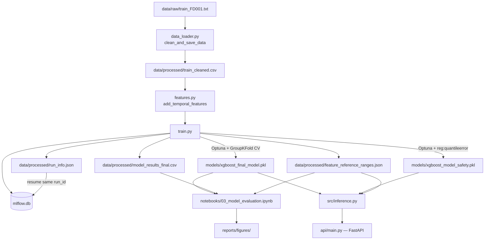

# Architecture

## Overview

This project predicts Remaining Useful Life (RUL) for turbofan engines using
the NASA CMAPSS FD001 dataset (single operating condition, single fault
mode). It produces two models — a point-estimate champion model and a
conservative quantile "safety" model — plus the evaluation tooling needed to
turn a raw RUL number into an operational maintenance decision (health score,
inspect/ground action, business cost impact).

The two structural rules the codebase enforces throughout:

1. **Notebooks orchestrate, `src/` implements.** Any logic used more than
   once (scoring, feature engineering, business rules) lives in `src/` and is
   imported — never redefined inline in a notebook.
2. **Evaluation never depends on training's live state.**
   `03_model_evaluation.ipynb` starts from a fresh kernel and only reads
   artifacts `02_model_training.ipynb` / `src/train.py` persisted to disk.
   `dvc.yaml` enforces this mechanically: the `evaluate` stage's `deps` are
   exactly those persisted files, nothing else.

## Data flow

## Module responsibilities

| Module | Responsibility | Consumed by |
|---|---|---|
| `data_loader.py` | Raw CMAPSS ingestion, piecewise RUL capping, drops near-constant sensors | `train.py`, `02_model_training.ipynb` |
| `features.py` | Rolling mean/std per sensor, grouped by unit (never crosses engine boundaries) | `train.py`, `inference.py` |
| `evaluation.py` | Scoring (`nasa_score`, `pinball_loss`), health score, maintenance actions, slice metrics, robustness testing, bootstrap significance, OOD reference ranges, business impact, SHAP computation | `train.py`, `inference.py`, both notebooks |
| `train.py` | End-to-end training pipeline: split, feature engineering, baseline, Optuna-tuned champion + safety models, MLflow logging, artifact export, post-train sanity check | `02_model_training.ipynb`, `scripts/train.sh`, `dvc.yaml` |
| `inference.py` | Production inference: `predict_unit_health` (number only) and `predict_with_explanation` (number + OOD flag + local SHAP drivers) | `api/main.py`, `train.py`'s sanity check |
| `utils.py` | Config loading, repo-root-relative path resolution (`resolve()`), seeding | `train.py` |

## Key design decisions

**Fixed-scale health score, not batch-relative.**
`compute_health_score` normalizes against `config.data.max_rul` (a constant),
not the min/max of whatever engines happen to be in the current evaluation
batch. A batch-relative score would mean the same engine gets a different
health score depending on which other engines are being scored alongside it
— useless as a stable, comparable-over-time safety signal.

**Nested cross-validation for both the Optuna search and the stability check.**
`make_objective`'s CV loop scores each outer fold on rows that were *never*
used for early stopping (a separate inner split handles that). `robust_cv_check`
uses the same nested pattern for the same reason — scoring on the early-stopping
fold directly would make the reported variance optimistically biased, which
defeats the point of a stability check.

**Percentile-range OOD detection, not a multivariate model.**
`compute_feature_reference_ranges` / `check_out_of_distribution` flag a
prediction as out-of-distribution using simple per-feature training
percentiles, not a Mahalanobis distance or IsolationForest. This is a
deliberate simplicity-over-power tradeoff: "3 of 18 features are outside
their training range" is something an operator can act on; a multivariate
anomaly score is not. The known limitation is that it can miss anomalies that
are only visible in feature *combinations* (each feature individually in
range, but the combination isn't) — a reasonable next iteration if that
matters for a given deployment, not required to demonstrate the concept.

**MLflow run continuity across notebooks.**
`train.py` persists `run_info.json` with the champion/safety run IDs. The
evaluation stage resumes logging into those exact runs
(`mlflow.start_run(run_id=...)`) rather than creating a disconnected
"evaluation" run — training metrics and evaluation artifacts (SHAP plots,
robustness results, business impact) stay attached to the same model version
in the MLflow UI.

**Business impact counts the full alert zone, not just the critical sub-zone.**
`compute_business_impact` counts a "missed failure" whenever true RUL is
inside the alert zone (`< alert_threshold`) and the model predicted above it
— not only when true RUL was inside the stricter critical sub-zone. An
earlier version only checked the critical sub-zone, which left true RUL in
`[critical_threshold, alert_threshold)` paired with an over-confident
prediction completely unscored in the cost model.

## Data contracts

| File | Written by | Schema |
|---|---|---|
| `data/processed/train_cleaned.csv` | `data_loader.clean_and_save_data` | `unit, cycle, op_setting_*, sensor_*, RUL` |
| `data/processed/model_results_final.csv` | `train.export_artifacts` | `unit, cycle, RUL, predicted_RUL, baseline_predicted_RUL, safety_RUL, absolute_error` |
| `data/processed/test_features_engineered.csv` | `train.export_artifacts` | `unit, cycle, <engineered feature columns>` (no `RUL`) |
| `data/processed/feature_reference_ranges.json` | `train.export_artifacts` | `{feature_name: {low, high}}`, training-set percentiles |
| `data/processed/run_info.json` | `train.export_artifacts` | `{champion_run_id, safety_run_id}` |
| `data/processed/baseline_metrics.json` | `train.train_baseline` | `{rmse_baseline, mae_baseline, nasa_baseline}` |